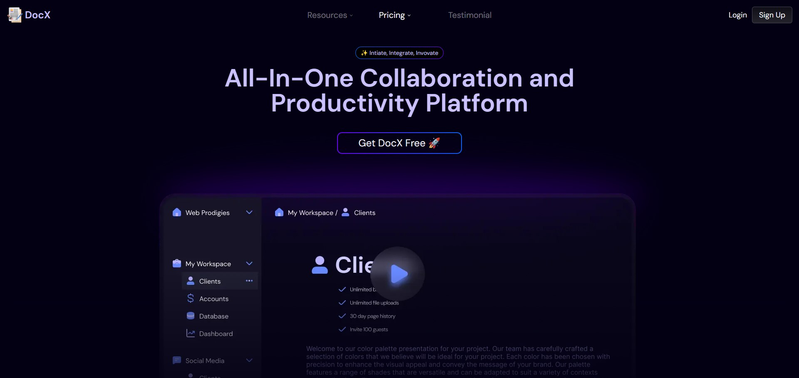
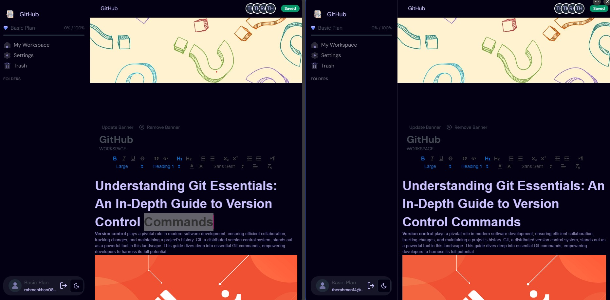
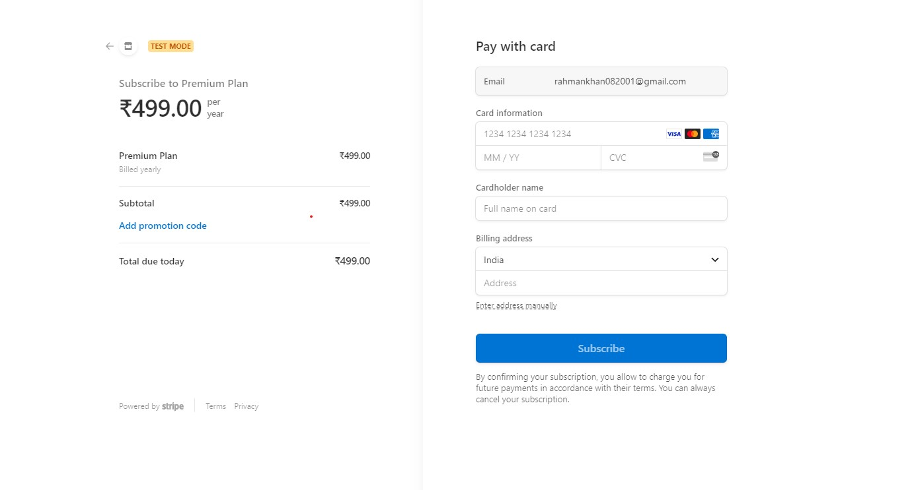

# DocX

[DocX](https://doc-x-neon.vercel.app/) is an innovative document management platform designed to revolutionize the way teams collaborate and manage their documents. It offers a comprehensive workspace and collaboration environment tailored for seamless teamwork and efficient document handling.

## Key Features

1. Efficient Document Handling & Data Management
2. Real-Time Collaboration
3. Easy Sharing and Customizable Interface
4. Organized Information Hierarchy
5. Security and Access Control
6. Monetization Features
7. Recovery Capabilities

## Technologies Used

The technologies and tools used to develop this project are:

- TailwindCSS
- TypeScript
- React
- Next.js
- Supabase
- Stripe

## Installation

For installation instructions, refer to the [Installation Guide](./INSTALLATION.md).

### Usage Guide

To effectively utilize the platform, follow these steps:

1. **Sign Up and Profile Completion**

   - Access the portal and complete your profile after signing up.

2. **Workspace Creation and File Addition**

   - Create a workspace and add files relevant to your tasks.

3. **Documentation Making**

   - Initiate your Documentation-making process within the workspace.

## Screenshots







## Contributing

Contributions to DocX are welcome! To contribute, follow these steps:

1. Fork the repository.
2. Create a new branch for your feature or bug fix:

   ```bash
   git checkout -b feature/your-feature-name
   ```

3. Make changes and commit them:

   ```bash
   git commit -m "Add your commit message here"
   ```

4. Push your changes to your branch:

   ```bash
   git push origin feature/your-feature-name
   ```

5. Create a pull request on the main repository.

Please follow the project's coding guidelines and maintain a clean commit history.

## License

This website is licensed under the MIT License. See the [LICENSE](LICENSE) file for details.

## Contact

If you have any questions or feedback, feel free to reach out to us at <therahman14@gmail.com>. We're excited to hear from you and make this project even better!
